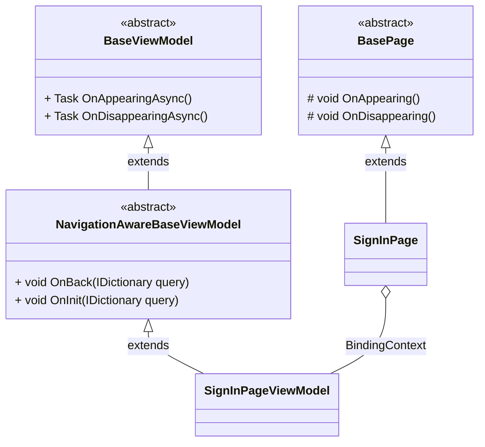
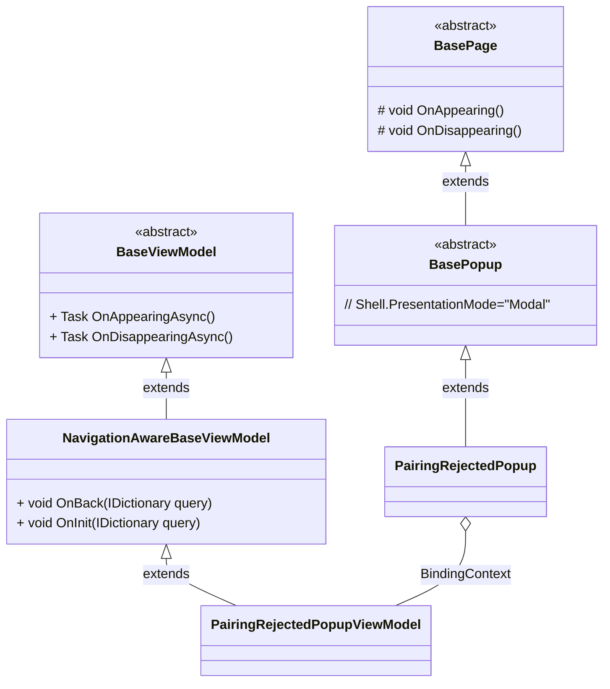
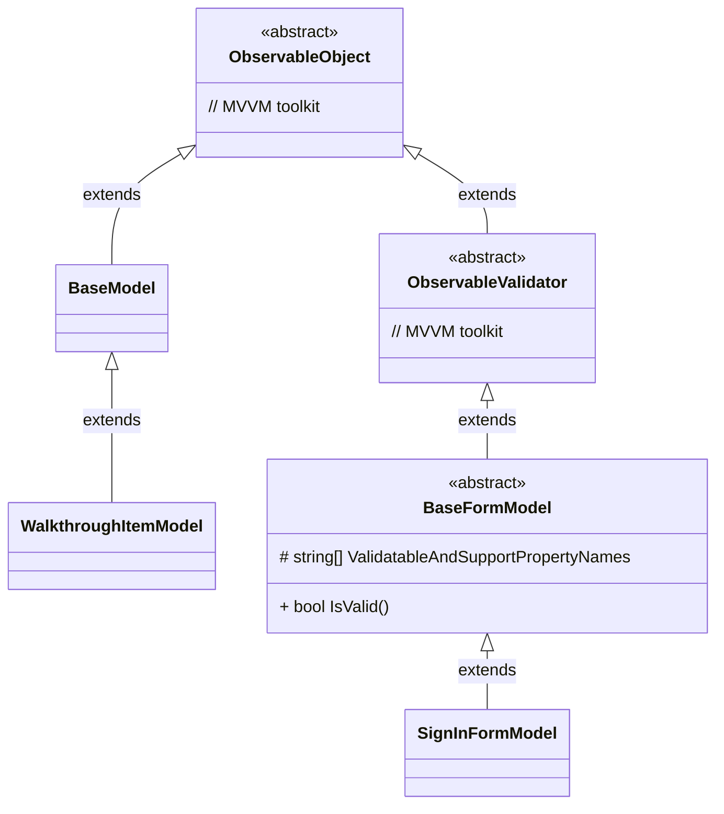

# Overview

A small application to demo how to structure and architect a MAUI application.

# UI Design
The app is built based on [Chick & Paddy UI/UX design](https://www.figma.com/file/9c7eVSVWLxGgq6biJq7wxm/Chick-%26-Paddy-App) by [Na Le](https://www.facebook.com/profile.php?id=100024559789551)

## Screenshots
<table width="100%">
<tr>
<td>

</td>
<td>

</td>
</tr>
<tr>
<td>

</td>
<td>

</td>
</tr>
</table>

# Documents
- [High Level Design](./docs/high-level-design.md)

## How-tos

## Steps to create a new page

As we organize our app in Features with a consistent fold structure as description in [High Level Design](./docs/high-level-design.md), below are key steps to add a new page for a feature.

- Create a feature folder under `Features` if not exist
  - folder name must be the feature name
- Create a `Pages` folder under the created feature folder
- Create
  - a XAML page - inherits from `BasePage`
  - a VM class - inherits from `NavigationAwareBaseViewModel` or `BaseViewModel`

e.g. The `SignIn` page of `Auth` feature will have below structure
```
|
|--Features
    |--Auth
        |--Pages
            |--SignInPage.xaml
            |--SignInPage.xaml.cs
            |--SignInPageViewModel.cs
```

class diagram


### Use script

```
# e.g. dotnet cake --target=page --feature Auth --name SignIn
dotnet cake --target=page --feature FEATURE_NAME --name PAGE_NAME_WO_SUFFIX
```

## Steps to create a new popup

As we organize our app in Features with a consistent fold structure as description in [High Level Design](./docs/high-level-design.md), below are key steps to add a new popup for a feature.

- Create a feature folder under `Features` if not exist
  - folder name must be the feature name
- Create a `Popups` folder under the created feature folder
- Create
  - a XAML page - inherits from `BasePopup`
  - a VM class - inherits from `NavigationAwareBaseViewModel` or `BaseViewModel`

e.g. The `PairingRejectedPopup` page of `Pairing` feature will have below structure
```
|
|--Features
    |--Pairing
        |--Popups
            |--PairingRejectedPopup.xaml
            |--PairingRejectedPopup.xaml.cs
            |--PairingRejectedPopupViewModel.cs
```

class diagram


### Use script

```
# e.g. dotnet cake --target=popup --feature Pairing --name PairingRejected
dotnet cake --target=popup --feature FEATURE_NAME --name POPUP_NAME_WO_SUFFIX
```

## Steps to create a new model

As we organize our app in Features with a consistent fold structure as description in [High Level Design](./docs/high-level-design.md), below are key steps to add a new model for a feature.

- Create a feature folder under `Features` if not exist
  - folder name must be the feature name
- Create a `Models` folder under the created feature folder
- Create
  - a Model class - inherits from `BaseModel` or `BaseFormModel`

> `BaseFormModel` will be used when the UI are entry elements; otherwise `BaseModel`. `BaseFormModel` will leverage [the validation feature](https://learn.microsoft.com/en-us/windows/communitytoolkit/mvvm/observablevalidator) of [MVVM toolkit](https://learn.microsoft.com/en-us/windows/communitytoolkit/mvvm/introduction).

e.g.
- The `SignIn` form model of `Auth` feature will have below structure
```
|
|--Features
    |--Auth
        |--Models
            |--SignInFormModel.cs
```

- The `WalkthroughItem` model of `Landing` feature will have below structure
```
|
|--Features
    |--Landing
        |--Models
            |--WalkthroughItemModel.cs
```

class diagram


### Use script

```
# e.g. dotnet cake --target=model --form true --feature Auth --name SignIn
dotnet cake --target=popup --feature FEATURE_NAME --name MODEL_NAME_WO_SUFFIX --form true

# e.g. dotnet cake --target=model --feature Landing --name WalkthroughItem
dotnet cake --target=popup --feature FEATURE_NAME --name MODEL_NAME_WO_SUFFIX
```

# Open Source libraries
- [MAUI Community Toolkit](https://github.com/xamarin/XamarinCommunityToolkit)
- [MVVM Toolkit](https://learn.microsoft.com/en-us/windows/communitytoolkit/mvvm/introduction)

# Other resources
- [Material Design Icons](https://materialdesignicons.com/)
- [Archia Font](https://befonts.com/archia-font-family.html) - paid and in design
- [Montserrat Font](https://fonts.google.com/specimen/Montserrat?query=monts) - Free, alternative

# Maintainer

This project is maintained by [tuyen-vuduc](https://github.com/tuyen-vuduc) in his spare time.<br>

If you find this project is useful, please become a sponsor of the project and/or buy him a coffee.

[](https://www.buymeacoffee.com/tuyen.vuduc)

# License
The 3rd libraries will follow their associated licenses. This project itself is license under MIT license.

Copyright 2022 Tuyen Vu

Permission is hereby granted, free of charge, to any person obtaining a copy of this software and associated documentation files (the "Software"), to deal in the Software without restriction, including without limitation the rights to use, copy, modify, merge, publish, distribute, sublicense, and/or sell copies of the Software, and to permit persons to whom the Software is furnished to do so, subject to the following conditions:

The above copyright notice and this permission notice shall be included in all copies or substantial portions of the Software.

THE SOFTWARE IS PROVIDED "AS IS", WITHOUT WARRANTY OF ANY KIND, EXPRESS OR IMPLIED, INCLUDING BUT NOT LIMITED TO THE WARRANTIES OF MERCHANTABILITY, FITNESS FOR A PARTICULAR PURPOSE AND NONINFRINGEMENT. IN NO EVENT SHALL THE AUTHORS OR COPYRIGHT HOLDERS BE LIABLE FOR ANY CLAIM, DAMAGES OR OTHER LIABILITY, WHETHER IN AN ACTION OF CONTRACT, TORT OR OTHERWISE, ARISING FROM, OUT OF OR IN CONNECTION WITH THE SOFTWARE OR THE USE OR OTHER DEALINGS IN THE SOFTWARE.